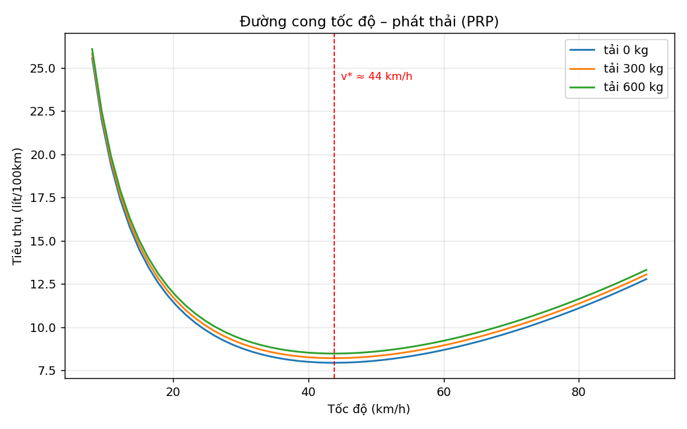
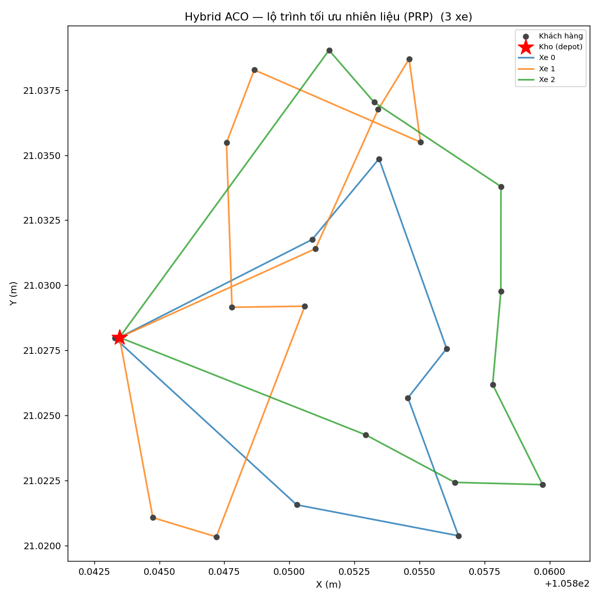
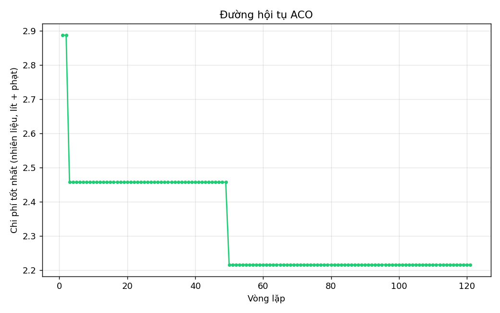
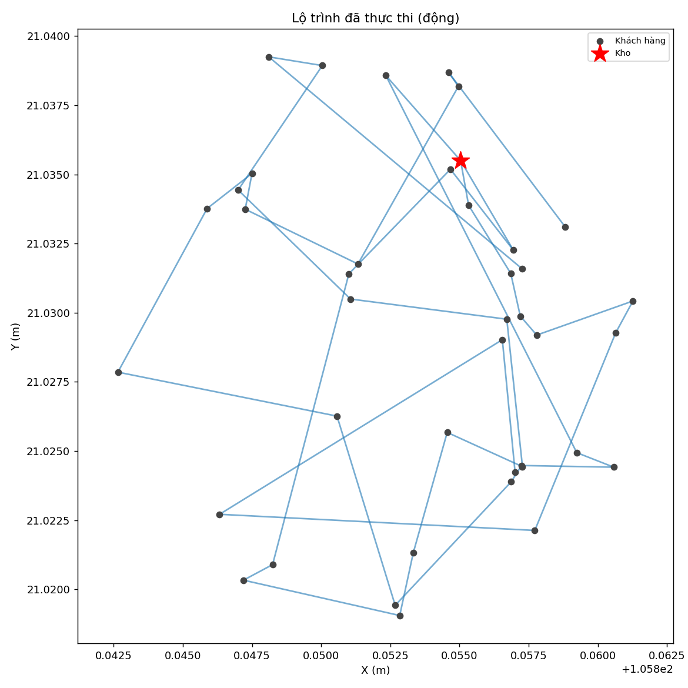
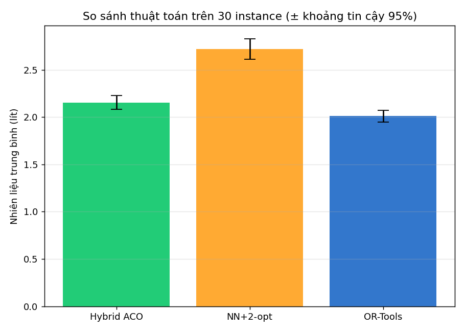
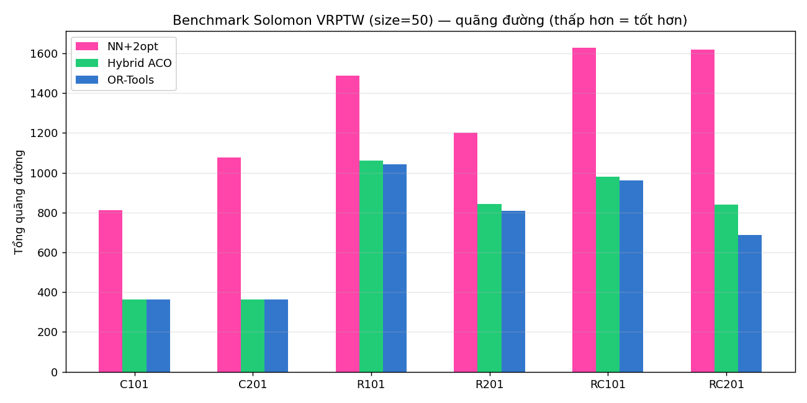

# Định tuyến động & gom hàng thông minh nhận biết phát thải (E10)

Bài toán giao hàng đô thị có **đơn phát sinh đột xuất, tắc đường, giờ cao điểm**,
tối ưu **nhiên liệu & CO₂** theo bối cảnh **Hà Nội chuyển sang xăng E10 (2026)**.

Lõi thuật toán: **Hybrid Ant Colony Optimization** (MAX-MIN Ant System + local
search) trên nền **Time-Dependent VRPTW** với hàm mục tiêu là **mô hình phát thải
phụ thuộc tốc độ (Pollution-Routing Problem)**. Dữ liệu bản đồ **thật** từ
OpenStreetMap (OSMnx).

## Điểm nổi bật học thuật
- **Mô hình phát thải PRP theo tốc độ** (Bektaş & Laporte 2011; CMEM): nhiên liệu
  phụ thuộc tốc độ–tải–gia tốc–độ dốc, có **tốc độ tối ưu** v\* ≈ 44 km/h.
- **Giao thông phụ thuộc thời điểm**: hệ số tắc theo giờ cao điểm → tốc độ giảm →
  nhiên liệu tăng (đo được **+16.6%** trên cùng lộ trình khi vào giờ kẹt).
- **Loại nhiên liệu E0/E5/E10**: E10 tốn thêm ~3.6% thể tích nhưng **rẻ hơn ~3.8%**
  và **giảm ~6.7% CO₂ hoá thạch**.
- **Định tuyến động**: rolling-horizon, đơn phát sinh, warm-start pheromone.
- **Benchmark**: so với Nearest-Neighbor, NN+2-opt, và **Google OR-Tools**.

## Cấu trúc
```
config.py                 # toàn bộ tham số (bài toán, PRP, ACO, giao thông, nhiên liệu)
src/
  graph_loader.py         # tải bản đồ thật (OSMnx) + ma trận + hình học đường phố
  problem.py              # Order/Vehicle + sinh instance (gồm đơn động)
  emission_model.py       # mô hình phát thải PRP theo tốc độ + E10 + CO₂
  travel.py               # hệ số tắc đường theo giờ cao điểm
  aco_solver.py           # Hybrid ACO (MMAS + 2-opt/Or-opt/relocate + warm-start)
  baseline.py             # NN, NN+2-opt, OR-Tools
  dynamic_sim.py          # mô phỏng động rolling-horizon
  metrics.py              # chỉ số: quãng đường, nhiên liệu, CO₂, tốc độ, vi phạm TG
  visualize.py            # vẽ lộ trình, hội tụ, đường cong tốc độ–phát thải
  benchmark.py            # loader Solomon + DistanceModel (mục tiêu quãng đường)
experiments/
  run_static.py           # ACO tĩnh + so sánh baseline
  run_dynamic.py          # động vs tĩnh (giá trị của tái tối ưu)
  run_fueltype.py         # so sánh E0/E5/E10
  run_emission.py         # đường cong tốc độ–phát thải + tác động giờ cao điểm
  run_benchmark.py        # benchmark chuẩn Solomon VRPTW (6 lớp)
  run_statistics.py       # đa-seed: trung bình ± CI95 + Wilcoxon signed-rank
data/solomon/             # 6 instance Solomon thật (C101/C201/R101/R201/RC101/RC201)
webapp/
  server.py               # máy chủ http.server (không cần Flask)
  index.html              # giao diện Leaflet (bản đồ thật, kiểu Google Maps)
```

## Cài đặt
```bash
pip install -r requirements.txt      # numpy, networkx, matplotlib, osmnx
pip install ortools                  # tùy chọn — bật baseline OR-Tools
```
Lần chạy đầu sẽ tải bản đồ quận Hoàn Kiếm từ OSM và cache vào `data/graph.graphml`.

## Chạy thí nghiệm (in số liệu + lưu ảnh vào `outputs/`)
```bash
python -m experiments.run_static     # Hybrid ACO vs baseline
python -m experiments.run_dynamic    # định tuyến động vs tĩnh
python -m experiments.run_fueltype   # E0 / E5 / E10
python -m experiments.run_emission   # tốc độ–phát thải + giờ cao điểm
python -m experiments.run_benchmark 25   # Solomon (size 25 | 50 | 100)
python -m experiments.run_statistics 10  # đa-seed + CI95 + Wilcoxon
```

### Độ tin cậy thống kê (đã bổ sung)
**Đa-seed N=30 (Hà Nội, 25 đơn), trung bình ± CI95, mục tiêu nhiên liệu PRP:**

| Thuật toán | Nhiên liệu (L) | Quãng đường (km) | Số xe |
|---|---|---|---|
| **Hybrid ACO** | 2.154 [2.083, 2.225] | 23.45 | 3.8 |
| NN+2-opt | 2.718 [2.609, 2.826] | 29.46 | 4.3 |
| OR-Tools | 2.011 [1.949, 2.073] | 21.68 | 3.6 |

Kiểm định **Wilcoxon signed-rank (bắt cặp)**: ACO vượt NN+2-opt **+20.7%, thắng 30/30,
p≈1.9e-9**; kém OR-Tools **7.1%, p≈9.3e-9**. CI của ACO và NN+2-opt **không chồng lấn**.
Biểu đồ: `outputs/statistics_fuel.png`.

**Benchmark chuẩn Solomon (100 khách), mục tiêu quãng đường:**
- Lớp **clustered chặt** (C101): ACO **854 vs best-known 829 (+3%), đúng 10 xe** — sát tối ưu.
- Trung bình các instance khả thi: ACO cách BKS ~6% (lưu ý: solver dùng **đội xe cố định**
  và tối thiểu quãng đường, khác mục tiêu phân cấp "ít xe trước" của Solomon nên số xe có
  thể lệch BKS).
- **Hạn chế ở quy mô 100 khách**: lớp cửa sổ TG chặt (R1/RC1) ACO còn **vi phạm cửa sổ
  thời gian** (đánh dấu `*`) — cần cơ chế sửa khả thi mạnh hơn (ALNS). Bản 25/50 khách
  thì ACO khả thi ổn định.

## Giao diện bản đồ thực (kiểu Google Maps)
```bash
python -m webapp.server              # rồi mở http://localhost:8000
```


Bảng điều khiển cho phép đổi số đơn/xe/tải, loại nhiên liệu (E0/E5/E10), giờ khởi
hành, bật/tắt tắc đường, và chế độ **tĩnh** (lộ trình tối ưu) hoặc **động** (đơn
phát sinh + tái tối ưu). Lộ trình được vẽ **bám theo đường phố thật**; bảng chỉ số
hiển thị nhiên liệu, chi phí, CO₂, tốc độ trung bình.

Hai tính năng quan trọng:
- **Tự chọn điểm trên bản đồ**: chọn "Nguồn điểm → Tự chọn", rồi **nhấp bản đồ**
  để đặt kho (điểm đầu) và các đơn giao. Hệ thống snap mỗi điểm vào nút đường gần
  nhất và tính lộ trình tối ưu.
- **So sánh thuật toán**: chọn Hybrid ACO / OR-Tools / NN+2-opt để đối chiếu trực
  tiếp trên cùng bộ điểm.


Điểm được lấy mặc định **ngẫu nhiên** từ các nút đường OSM (`graph_loader.sample_nodes`);
ở chế độ tự chọn thì lấy từ vị trí người dùng nhấp (`graph_loader.nearest_node`).

## Kết quả & hình ảnh

Các ảnh dưới đây sinh ra từ thư mục `outputs/` khi chạy các thí nghiệm.

**Đường cong tốc độ – phát thải (PRP)** — tồn tại tốc độ tối ưu v\* ≈ 44 km/h; đi
quá chậm (tắc đường) hay quá nhanh đều tốn nhiên liệu:



**Lộ trình tối ưu (Hybrid ACO, bản đồ Hoàn Kiếm)** và **đường hội tụ ACO:**




**Lộ trình đã thực thi ở chế độ động** (đơn phát sinh + tái tối ưu):



**So sánh thuật toán trên 30 instance (± khoảng tin cậy 95%)** — ACO vượt NN+2-opt
có ý nghĩa, kém OR-Tools ~7%:



**Benchmark chuẩn Solomon VRPTW (tổng quãng đường, thấp hơn = tốt hơn):**



## Hạn chế & hướng phát triển
- Hybrid ACO còn kém OR-Tools ~5.9% (đã thu hẹp từ ~38%); cần ALNS để tiến sát hơn,
  nhất là trên lớp R/RC tắc cửa sổ thời gian.
- Giao thông động dùng hồ sơ giờ cao điểm tổng hợp; có thể thay bằng dữ liệu thật.
- Mở rộng tiềm năng: đa mục tiêu (Pareto chi phí–CO₂), đội xe hỗn hợp EV + E10,
  bất định ngẫu nhiên (stochastic/robust), DRL dẫn dắt heuristic.

## Tham khảo
- Bektaş, Laporte (2011). *The Pollution-Routing Problem*. Transportation Research B.
- Demir, Bektaş, Laporte (2012). *An adaptive large neighborhood search for the PRP*.
- Ichoua, Gendreau, Potvin (2003). *Vehicle dispatching with time-dependent travel times*.
- Solomon (1987). *VRPTW benchmark instances*.
- Dorigo, Stützle (2004). *Ant Colony Optimization* (MAX-MIN Ant System).
